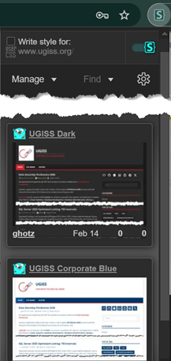

# Users Styles

Custom CSS to use with [Stylus](https://github.com/openstyles/stylus) browser extension
published at <https://userstyles.world/user/ghotz>

## Installation

1. Install Stylus extension from Chrome Web Store or from <https://github.com/openstyles/stylus>
2. Navigate to the site e.g. <https://ugiss.org>
3. Open the extension menu

4. Select the theme you want to apply

Note: you can associate multiple themes to a website and then simply enable/disable them without going through the find process every time.

# Styles

### UGISS (User Group Italiano SQL Server)

#### UGISS Dark Theme

#### UGISS Corporate Blue Theme

